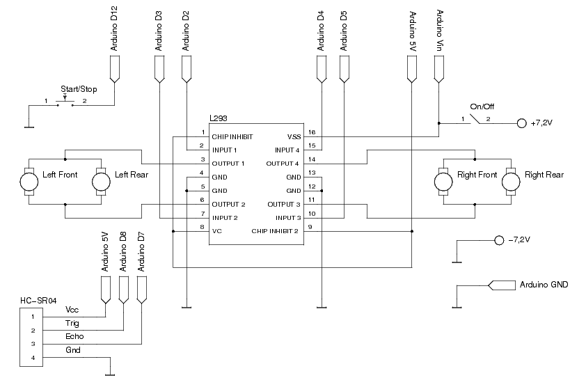

# roboCar

## Description
roboCar is a simple robotic car based on 4x4 chassis, driven by Arduino. It uses ultrasonic ranging module HC-SR04 to detect and evade obstacles. 

Current program implements following algorithm :
* drive forward
* when obstacle is detected, turn left or right (random)
* goto 1

Motor driver uses single L293D. Motors on one side chassis are bridged and always rotates in the same direction. Diagram will be added later.
Basic PWN speed conrol is also implemented.

## Electrical diagram

